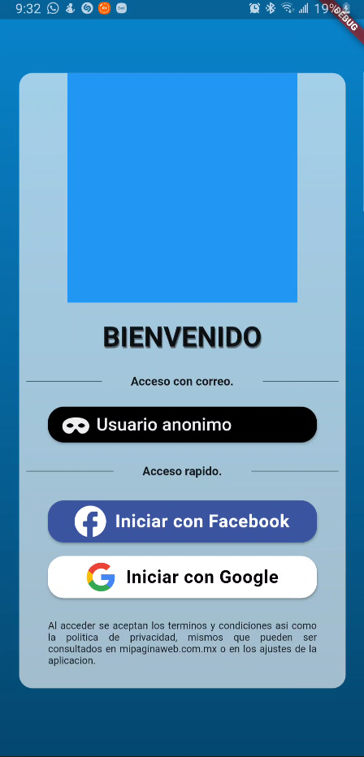
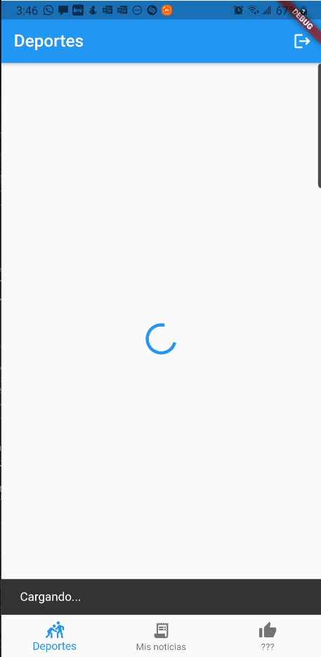
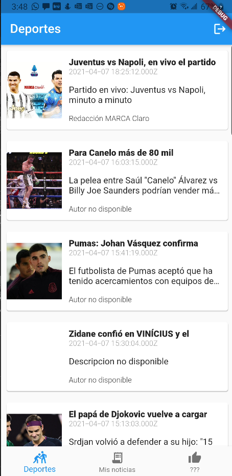
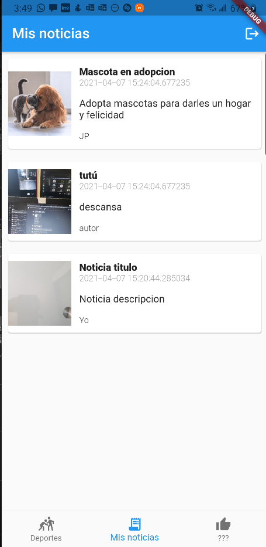
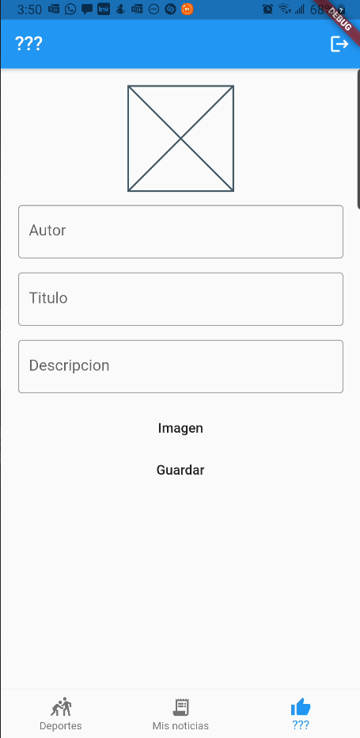

# App 15

App intro para utilizar un BaaS.
- Autenticacion con firebase
- Configuracion del proyecto
- Autenticacion con redes sociales
- Usuarios anonimos
--------------------------
- Firebase firestore NoSQL
- Firebase storage (files)

## Getting Started

Recuerda que despues de clonar el proyecto, abrir una terminal dentro de la carpeta del proyecto y ejecutar el comando:

```sh
flutter packages get
``` 

## App Screenshot








